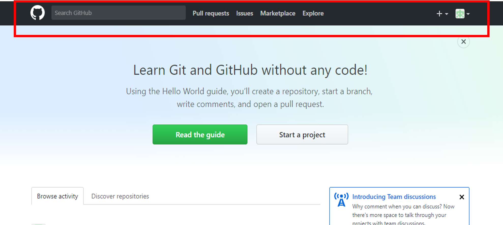
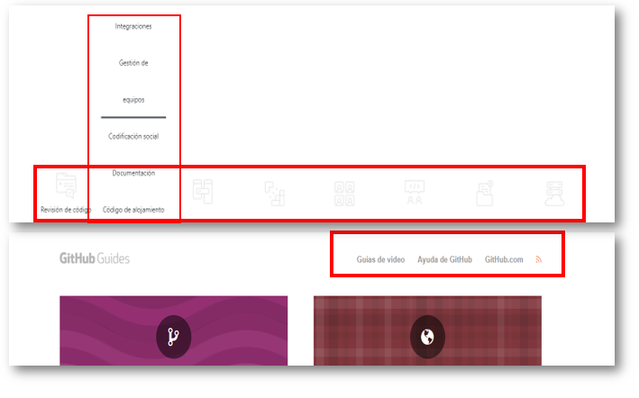
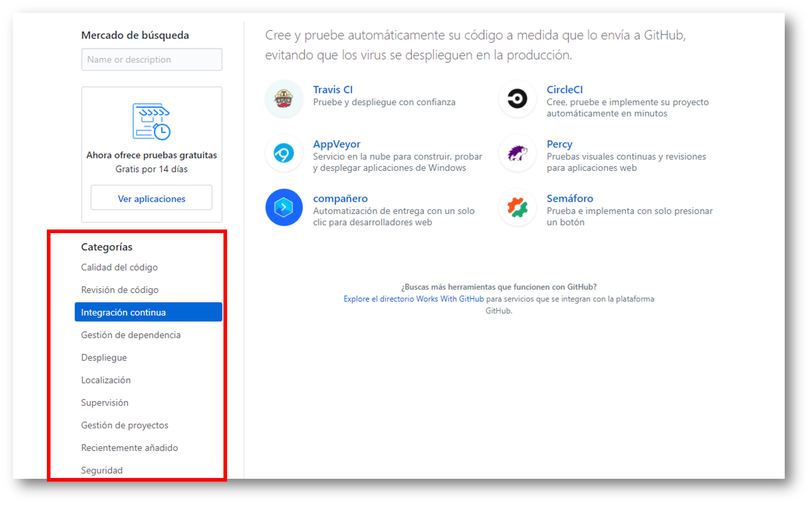
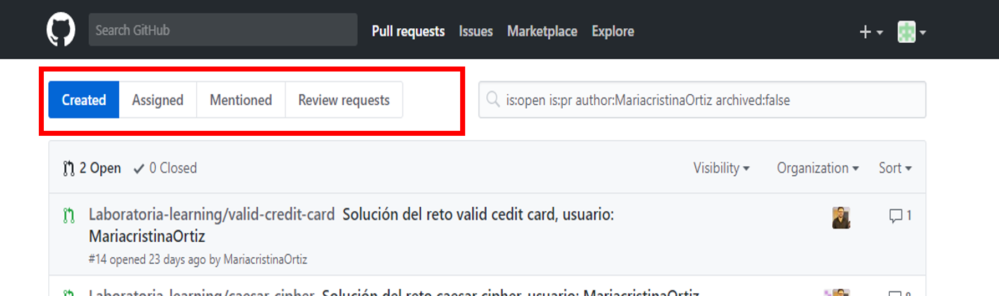
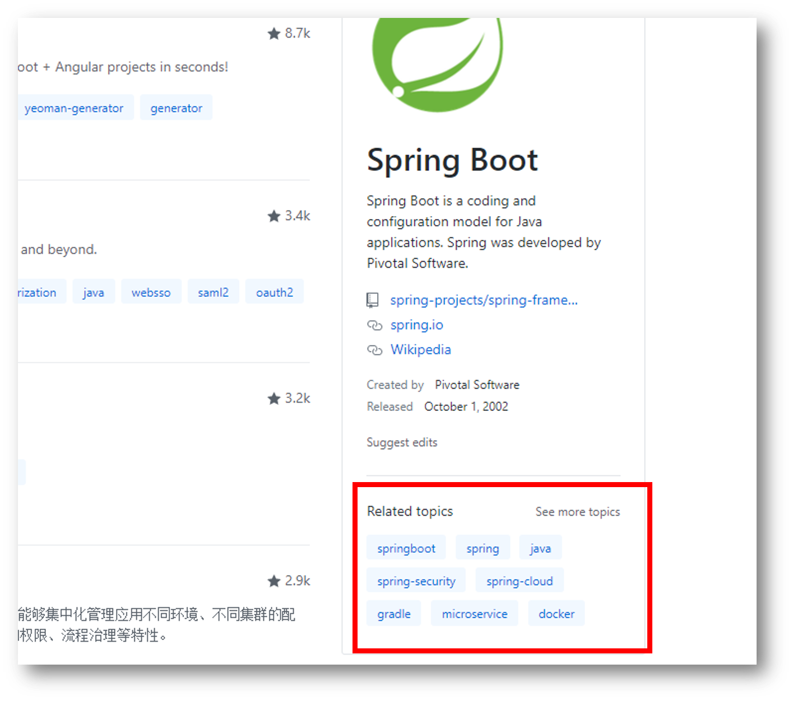
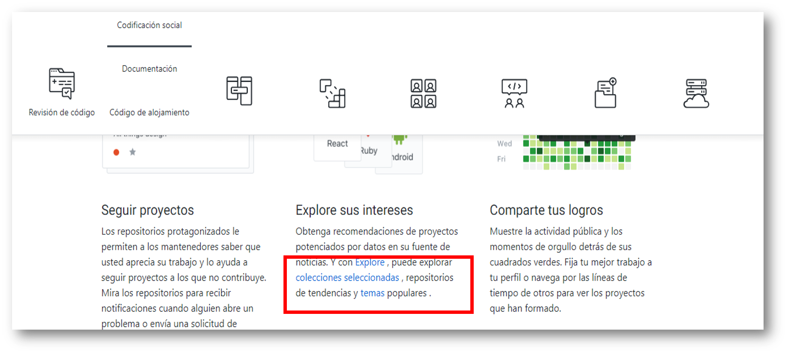

# GITHUB (elementos de navegación)

* **Curso:** _Creando tu primer sitio web interactivo_
* **Unidad:** _Intro a User Experience Design_

## Objetivo

Identificar los elementos de navegación de la wesite **Github**.

## Alumna
* Maria Cristina Ortiz Villafuerte.

## Descripción

Se muestra la identificación de los elementos de navegación de la wewbsite **Github**:

### Navegación global

### Navegación local

### Navegación facetada

### Navegación contextual

### Navegación filtrada

### Navegación inline

